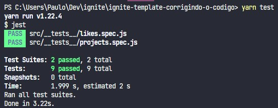
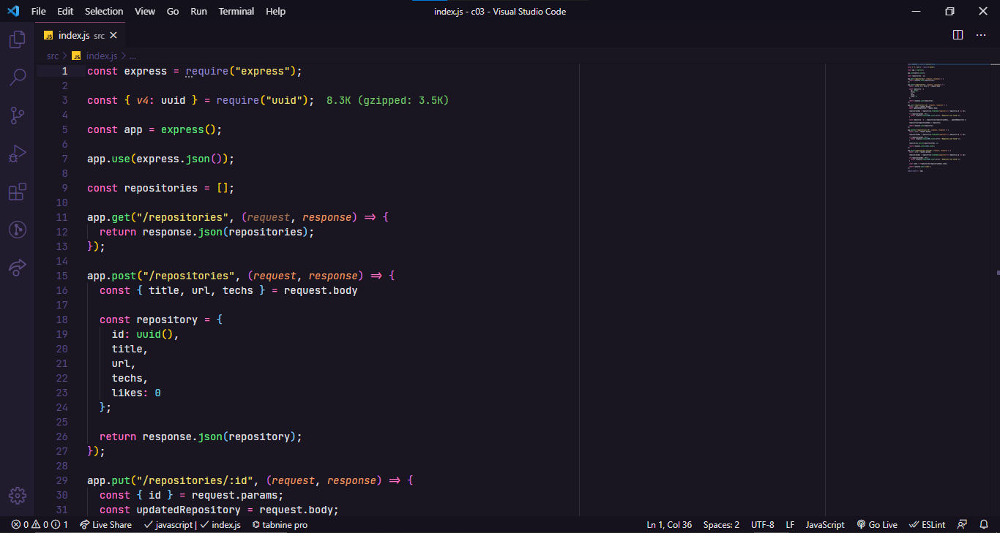

# Desafio 3 do Ignite Trilha NodeJS


<h3 align="center">
  Desafio 03: Corrigindo o Código
</h3>

<p align="center">“Faça seu melhor, mas sempre com prazo de entrega”!</blockquote>

<p align="center">
  

  <a href="https://rocketseat.com.br">
    
  </a>

  

  <a href="https://github.com/rocketseat-education/ignite-template-corrigindo-o-codigo/stargazers">
    
  </a>
</p>


<p align="center">
  <a href="#rocket-sobre-o-desafio">Sobre o desafio</a>&nbsp;&nbsp;&nbsp;|&nbsp;&nbsp;&nbsp;
  <a href="#keyboard-instalação-e-execução-do-projeto">Instalação e Execução do Projeto</a>&nbsp;&nbsp;&nbsp;|&nbsp;&nbsp;&nbsp;
  <a href="#template-da-aplicação">Template da aplicação</a>&nbsp;&nbsp;&nbsp;|&nbsp;&nbsp;&nbsp;
  <a href="#rotas-da-aplicação-instruções">Rotas da aplicação</a>&nbsp;&nbsp;&nbsp;|&nbsp;&nbsp;&nbsp;
  <a href="#especificação-dos-testes-instruções">Específicação dos testes</a>&nbsp;&nbsp;&nbsp;|&nbsp;&nbsp;&nbsp;
  <a href="#memo-licença">Licença</a>
</p>

## :rocket: Sobre o desafio

Nesse desafio, tive que corrigir uma aplicação Node.js que está em processo de desenvolvimento e que já possui os testes necessários para fazer toda a validação dos requisitos sem mexer nos testes.

Foram feitas algumas alterações propositais no código da aplicação e, com isso, parte dos testes deixaram de passar. Agora só você pode resolver esse problema. Bora lá? 🚀

Essa aplicação realiza o CRUD (**C**reate, **R**ead, **U**pdate, **D**elete) de repositórios de projetos. Além disso, é possível dar likes em repositórios cadastrados, aumentando a quantidade de likes em 1 a cada vez que a rota é chamada.

A estrutura de um repositório ao ser criado é a seguinte: 

```jsx
{
  id: uuid(),
  title,
  url,
  techs,
  likes: 0
}
```

Descrição de cada propriedade:

- **id** deve ser um uuid válido;
- **title** é o título do repositório (por exemplo "unform");
- **url** é a URL que aponta para o repositório (por exemplo "[https://github.com/unform/unform](https://github.com/unform/unform)");
- **techs** é um array onde cada elemento deve ser uma string com o nome de uma tecnologia relacionada ao repositório (por exemplo: ["react", "react-native", "form"]);
- **likes** é a quantidade de likes que o repositório recebeu (e que vai ser incrementada de 1 em 1 a cada chamada na rota de likes).

Note que a quantidade de likes deve sempre ser zero no momento de criação.

### :keyboard: Instalação e Execução do Projeto

- Clone este repositório

```
> git clone https://github.com/prenato84/ignite-template-corrigindo-o-codigo.git
```

- Navegue até o diretório principal do projeto

```
> cd ignite-template-corrigindo-o-codigo
```

- Instale as dependências com o Yarn

```
yarn
```

- Rode a suite de testes

```
yarn test
```

- Execute o projeto

```
yarn dev
```

<p align="center">
  
</p>

### Template da aplicação

Foi utilizado um modelo de template que possui o esqueleto do projeto.

O template pode ser encontrado na seguinte url: **[Acessar Template](https://github.com/rocketseat-education/ignite-template-corrigindo-o-codigo)**

> **Dica**: Caso não saiba utilizar repositórios do Github como template, utilize o guia em **[nosso FAQ](https://www.notion.so/ddd8fcdf2339436a816a0d9e45767664).**

Agora navegue até a pasta criada e abra no Visual Studio Code, lembre-se de executar o comando `yarn` no seu terminal para instalar todas as dependências, e você terá algo parecido com isso:

<p align="center">
  
</p>

### Rotas da aplicação (Instruções)

Documentação no Notion sobre a API e testes: **[Documentação API e Testes](hhttps://www.notion.so/Desafio-03-Corrigindo-o-c-digo-c15c8a2e212846039a367cc7b763c6dd#16f55f855f5942d0bf6df061c42119d9)**

#### POST `/repositories`

A rota deve receber `title`, `url` e `techs` pelo corpo da requisição e retornar um objeto com as informações do repositório criado e um status `204`.

#### PUT `/repositories/:id`

A rota deve receber `title`, `url` e `techs` pelo corpo da requisição e o `id` do repositório que deve ser atualizado pelo parâmetro da rota. Deve alterar apenas as informações recebidas pelo corpo da requisição e retornar esse repositório atualizado.

#### DELETE `/repositories/:id`

A rota deve receber, pelo parâmetro da rota, o `id` do repositório que deve ser excluído e retornar um status `204` após a exclusão.

#### POST `/repositories/:id/like`

A rota deve receber, pelo parâmetro da rota, o `id` do repositório que deve receber o like e retornar o repositório com a quantidade de likes atualizada.


### Especificação dos testes (Instruções)

Em cada teste, tem uma breve descrição no que sua aplicação deve cumprir para que o teste passe.

> :warning: Note que partes da aplicação já estão prontas e você precisará alterar apenas o que está errado (ou implementar algo que esteja faltando). 

> :bulb: Se você achou algum trecho de código confuso ou pensou em uma melhor solução, sinta-se livre para também refatorar.

> Caso você tenha dúvidas quanto ao que são os testes, e como interpretá\-los, dê uma olhada em **[nosso FAQ](https://www.notion.so/FAQ-Desafios-ddd8fcdf2339436a816a0d9e45767664)**.

Para esse desafio, temos os seguintes testes:

#### Testes de repositórios

- **Should be able to create a new repository**

Para que esse teste passe, você deve permitir que um novo repositório seja cadastrado pela rota **POST** `/repositories`. Caso precise confirmar o formato do objeto, você pode olhar [aqui.](https://www.notion.so/Desafio-03-Corrigindo-o-c-digo-c15c8a2e212846039a367cc7b763c6dd) 

Também é necessário que você retorne a resposta com o código `201`.

- **Should be able to list the projects**

Para que esse teste passe, é necessário que você conclua o teste anterior. Se tudo ocorreu bem, os repositórios cadastrados deverão aparecerem na listagem da rota **GET** `/repositories` e esse teste irá passar.

- **Should be able to update repository**

Para que esse teste passe, você deve permitir que um repositório seja atualizado a partir de seu `id` pela rota **PUT** `/repositories/:id` usando as [informações recebidas pelo corpo da requisição](https://www.notion.so/Desafio-03-Corrigindo-o-c-digo-c15c8a2e212846039a367cc7b763c6dd). Lembre-se de manter as informações que não foram passadas pelo corpo, por exemplo:
Se o usuário quiser trocar apenas o `title`, mantenha `url` e `techs` que já estavam no repositório.

- **Should not be able to update a non existing repository**

Para que esse teste passe, você deve verificar se o repositório existe antes de atualizar as informações na rota **PUT** `/repositories/:id`. Caso não exista, retorne um status `404` (que é o status para **Not Found**) com uma mensagem de erro no formato `{ error: "Mensagem do erro" }`.

- **Should not be able to update repository likes manually**

Para que esse teste passe, você deve impedir que a quantidade de likes de um repositório seja alterada manualmente através da rota **PUT** `/repositories/:id`.
Por exemplo:

**Errado:**

```jsx
// Repositório recém criado:
{
	id: "c160a99b-9d3b-4669-8a35-8dce1e8196ec",
	title: "Umbriel",
	techs: ["React", "ReactNative", "TypeScript", "ContextApi"],
	url: "https://github.com/Rocketseat/umbriel",
	likes: 0
}

// Requisição para alterar informações: 
// Rota: "/repositories/c160a99b-9d3b-4669-8a35-8dce1e8196ec"
// Método: PUT
// Corpo: { title: "Novo título", likes: 10 }

// Retorno:

{
	id: "c160a99b-9d3b-4669-8a35-8dce1e8196ec",
	title: "Novo título",
	techs: ["React", "ReactNative", "TypeScript", "ContextApi"],
	url: "https://github.com/Rocketseat/umbriel",
	likes: 10
}
```

**Certo:**

```jsx
// Repositório recém criado:
{
	id: "c160a99b-9d3b-4669-8a35-8dce1e8196ec",
	title: "Umbriel",
	techs: ["React", "ReactNative", "TypeScript", "ContextApi"],
	url: "https://github.com/Rocketseat/umbriel",
	likes: 0
}

// Requisição para alterar informações: 
// Rota: "/repositories/c160a99b-9d3b-4669-8a35-8dce1e8196ec"
// Método: PUT
// Corpo: { title: "Novo título", likes: 10 }

// Retorno:

{
	id: "c160a99b-9d3b-4669-8a35-8dce1e8196ec",
	title: "Novo título",
	techs: ["React", "ReactNative", "TypeScript", "ContextApi"],
	url: "https://github.com/Rocketseat/umbriel",
	likes: 0 // A quantidade de likes não mudou
}
```

- **Should be able to delete the repository**

Para que esse teste passe, você deve permitir que um repositório seja excluído através do `id` passado pela rota **DELETE** `/repositories/:id`.

- **Should not be able to delete a non existing repository**

Para que esse teste passe, você deve validar se o repositório existe antes de excluí-lo. Caso o repositório não exista, retorne um status `404` com uma mensagem de erro no formato `{ error: "Mensagem do erro" }`.

#### Testes de likes

- **Should be able to give a like to the repository**

Para que esse teste passe, deve ser possível incrementar a quantidade de likes em `1` a cada chamada na rota **POST** `/repositories/:id/like`. Use o `id` passado por parâmetro na rota para realizar essa ação.

- **Should not be able to give a like to a non existing repository**

Para que esse teste passe, você deve validar que um repositório existe antes de incrementar a quantidade de likes. Caso não exista, retorne um status `404` com uma mensagem de erro no formato `{ error: "Mensagem do erro" }`.

## :memo: Licença

Esse projeto está sob a licença MIT. Veja o arquivo [LICENSE](https://github.com/git/git-scm.com/blob/master/MIT-LICENSE.txt) para mais detalhes.

---

Feito com 💜 by <a href="https://www.linkedin.com/in/prenato84">Paulo Castro</a> :wave:
